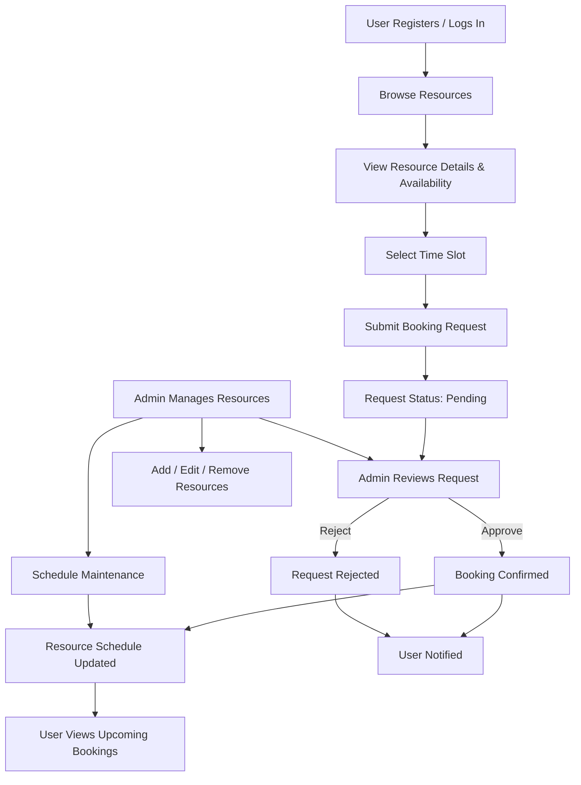

# Intra NITC Resource Management (IRM)

A full-stack MERN application that simplifies booking and management of shared campus resources such as GPU servers, laboratories, and research equipment at the National Institute of Technology Calicut.

## Live Demo

🔗 https://intra-nitc-resource-manager.vercel.app/login


# Why this project?

Many campus resources are shared across departments, but bookings are often handled manually through emails, spreadsheets, or paper forms. This makes it difficult to know resource availability, causes scheduling conflicts, and increases the administrative effort required to manage requests.

The Intra NITC Resource Management (IRM) system provides a centralized platform where users can discover available resources, request bookings, and track their status, while administrators manage approvals, schedules, and resource availability from a single dashboard.


# How it works

### User Workflow

1. Register using an institutional email.
2. Verify the email address.
3. Browse available resources.
4. View resource details and available time slots.
5. Submit a booking request with the intended purpose.
6. Track the request status from the dashboard.
7. View approved bookings in the personal schedule.

### Admin Workflow

1. Add and manage campus resources.
2. Review pending booking requests.
3. Approve or reject requests.
4. Schedule maintenance when required.
5. Monitor resource usage through the dashboard.




# Features

## Authentication

- Secure login and registration
- Email verification
- Password reset
- JWT authentication
- Refresh tokens
- Role-based access control

## Resource Booking

- Browse available resources
- View detailed resource information
- Check availability
- Submit booking requests
- Track request status
- Booking history
- Personalized schedule

## Administration

- Resource management (CRUD)
- Booking approval and rejection
- Maintenance scheduling
- User management
- Dashboard analytics

## User Experience

- Responsive design
- Search and filtering
- Pagination
- Form validation
- Modern UI with Tailwind CSS and Shadcn UI


# Tech Stack

## Frontend

- React.js (Vite)
- Tailwind CSS
- Shadcn UI
- React Hook Form
- Zod
- TanStack Query

## Backend

- Node.js
- Express.js
- JWT Authentication

## Database

- MongoDB


# Project Structure

```
intra-nitc-resource-manager/
│
├── client/
│   ├── src/
│   ├── components/
│   ├── pages/
│   ├── services/
│   ├── hooks/
│   └── utils/
│
├── server/
│   ├── controllers/
│   ├── middleware/
│   ├── models/
│   ├── routes/
│   ├── services/
│   └── utils/
│
├── README.md
└── CONTRIBUTING.md
```


# Getting Started

## Prerequisites

- Node.js 16+
- npm
- MongoDB (Local or Atlas)


## Clone the repository

```bash
git clone <repository-url>
cd intra-nitc-resource-manager
```


## Backend Setup

```bash
cd server
npm install
```

Create a `.env` file.

```env
PORT=8080
CLIENT_URL=http://localhost:5173

MONGODB_URI=

ACCESS_TOKEN_SECRET=
ACCESS_TOKEN_EXPIRY=24h

REFRESH_TOKEN_SECRET=
REFRESH_TOKEN_EXPIRY=10d

MAILTRAP_SMTP_HOST=
MAILTRAP_SMTP_PORT=
MAILTRAP_SMTP_USER=
MAILTRAP_SMTP_PASS=
```

Start the backend.

```bash
npm run dev
```


## Frontend Setup

```bash
cd client
npm install
npm run dev
```

Open

```
http://localhost:5173
```


# Screenshots

> Add screenshots here.

- Login
- Dashboard
- Browse Resources
- Resource Details
- Booking Request
- Admin Dashboard
- Resource Management


# Future Improvements

- Calendar integration
- Email notifications
- Resource usage analytics
- Department-wise reports
- Audit logs


# Contributors

- Mihir Vishnubhai Patel
- Saurabh Tripathi
- Mirza Munwwar Baig
